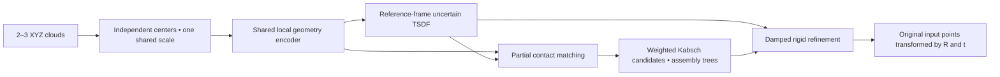

# Coarse shape priors for rigid fragment assembly

The supported workflow is **reassembly v2**: learn local geometry from XYZ, predict an uncertain whole-object scaffold, then recover rigid poses from contacts with scaffold guidance. It accepts **2–3 complete fragments** and returns matrices in the original reference fragment's coordinate frame.

This implementation starts from fresh weights. The neural models, data format, training entry point, and checkpoints are independent of the historical pipeline.



Start with [the Linux GPU server training guide](docs/REASSEMBLY_SERVER.md), [the v2 runbook](docs/REASSEMBLY_V2.md), and [data preparation notes](docs/REASSEMBLY_DATA.md). The default configuration is [configs/reassembly_v2.yaml](configs/reassembly_v2.yaml).

```bash
python -m pip install -r requirements.txt
python -m reassembly --help
python -m unittest discover -s tests -p 'test_reassembly*.py' -v
python -m reassembly acquire --config configs/reassembly_v2.yaml --dry-run
```

ShapeNet access is gated. The access check validates the bottle category archive's size before any download; an existing bottle mesh archive works through the same preparation interface. Preparation retains modeled cavities and rejects invalid sources, without hull replacement or component truncation.

The pilot uses 1,024 points per fragment, hierarchical 256 → 128 → 64 local groups, 128 channels, an implicit signed field, unmatched contact states, and explicit solver failures. Only the input fragments form the output assembly; generated geometry is guidance.

All stages are bounded to 2,000 updates. Training requires a matching preflight; held-out learning starts after the fixed 16-pattern fit check. CUDA preflight enforces **less than 20 GiB peak reserved memory**, with batch 2 → 1 fallback. Managed artifacts are capped at 40 GiB while preserving 50 GiB free space. A CPU check does not certify A5000 memory or learning performance.

Literature informs the design: [Neural Shape Mating](https://neural-shape-mating.github.io/) for complementary cuts, [Jigsaw](https://jiaxin-lu.github.io/Jigsaw/) for fracture matching, and [Jigsaw++](https://arxiv.org/html/2410.11816v2) for whole-shape guidance. No literature weights are loaded.

Historical experiments remain available in [the archived pipeline guide](docs/LEGACY_PIPELINE.md). Their scripts/configurations are unsupported by v2 and their checkpoints are rejected. Separate reproductions remain under [sota_repro](sota_repro/README.md).
