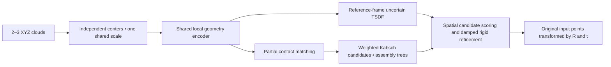

# Coarse shape priors for rigid fragment assembly

The current experimental workflow is **reassembly repair v3**: learn local contacts from XYZ, predict an uncertain whole-object scaffold, and use spatial scaffold agreement to rank and refine rigid assembly candidates. It accepts **2–3 complete fragments** and returns matrices in the original reference fragment's coordinate frame.

Start with [the repair VM guide](docs/REASSEMBLY_REPAIR.md) and [the versioned configuration](configs/reassembly_repair_bottles498.yaml). The previous pilot failed on fresh rotations/samples and on training geometry; the repair is implemented but its learning targets require new VM measurements. Existing v2 checkpoints are used only for the focused diagnostic, and new training starts fresh.

```bash
bash scripts/run_reassembly_repair.sh field
bash scripts/run_reassembly_repair.sh comparisons
bash scripts/run_reassembly_repair.sh replicate
bash scripts/run_reassembly_repair.sh scaffold
bash scripts/run_reassembly_repair.sh final-test
```

Run phases separately and inspect failed gates before continuing. The following v2 documentation remains available for preparation and exact replay.

This implementation starts from fresh weights. The neural models, data format, training entry point, and checkpoints are independent of the historical pipeline.



Start with [the Linux GPU server training guide](docs/REASSEMBLY_SERVER.md), [the v2 runbook](docs/REASSEMBLY_V2.md), and [data preparation notes](docs/REASSEMBLY_DATA.md). The default configuration is [configs/reassembly_v2.yaml](configs/reassembly_v2.yaml).

For the expanded bottle source pool, use [configs/reassembly_v2_bottles498.yaml](configs/reassembly_v2_bottles498.yaml). After server setup, `bash scripts/run_reassembly_v2_pilot.sh all` runs preparation through evaluation/reporting, saving logs and stopping at failed gates. It uses fresh stage weights and bounded pilot budgets.

```bash
python -m pip install -r requirements.txt
python -m reassembly --help
python -m unittest discover -s tests -p 'test_reassembly*.py' -v
python -m reassembly acquire --config configs/reassembly_v2.yaml --dry-run
```

ShapeNet access is gated. The access check validates the bottle category archive's size before any download; an existing bottle mesh archive works through the same preparation interface. Preparation retains modeled cavities and rejects invalid sources, without hull replacement or component truncation.

The pilot uses 1,024 points per fragment, hierarchical 256 → 128 → 64 local groups, 128 channels, an implicit signed field, unmatched contact states, and explicit solver failures. Only the input fragments form the output assembly; generated geometry is guidance.

The original v2 stages remain bounded to 2,000 updates. Repair v3 uses explicitly declared matched10,000-update experiments and stronger rotation/resampling/assembly gates; its Stage3 has no training phase. CUDA preflight enforces **less than20GiB peak reserved memory**, with batch2 →1 fallback. Managed artifacts are capped at40GiB while preserving50GiB free space. A CPU check does not certify GPU memory or learning performance.

Literature informs the design: [Neural Shape Mating](https://neural-shape-mating.github.io/) for complementary cuts, [Jigsaw](https://jiaxin-lu.github.io/Jigsaw/) for fracture matching, and [Jigsaw++](https://arxiv.org/html/2410.11816v2) for whole-shape guidance. No literature weights are loaded.

Historical experiments remain available in [the archived pipeline guide](docs/LEGACY_PIPELINE.md). Their scripts/configurations are unsupported by v2 and their checkpoints are rejected. Separate reproductions remain under [sota_repro](sota_repro/README.md).
